## Ajouter une animation

1. Sélectionnez un **composant**

1. Cliquez sur le bouton `Ajouter une animation` dans la barre d'outils

1. Dans la fenêtre qui s'affiche, saisissez les informations sur l'animation :

1. Sélectionnez une ligne qui correspond à la trajectoire de l'objet

> [!CAUTION]
> La ligne doit être droite car l'extension ne supporte pas encore les trajectoires arrondies ni les rotations

> [!CAUTION]
> Le nom des animations doit être unique, car sinon l'animation précédente sera remplacée

> [!CAUTION]
> Ajouter une animation à un composant qui en possède déjà une pour la mettre à jour

1. Cliquez sur le bouton `Ajouter l'animation`

⚠️ La trajectoire a été ajoutée

```mermaid
gantt
	title Exemple d'animations
	dateFormat DD
	axisFormat %d

    Animer le fond: 01, 12
    Déplacer le personnage : 01, 02
    Ouvrir la porte du garage : 02, 04
    Déplacer la voiture : 04, 12
    Ouvrir le portail: 07, 09
    Fermer le volet 1: 08, 09
    Fermer le volet 2: 09, 10
    Fermer le volet 3: 10, 11

```

## Jouer les animations

Pour jouer les animations, cliquez simplement sur le bouton `Jouer les animations`.

> [!TIP]
> Pour **simuler une rotation**, inclinez l'objet et lui appliquer une trajectoire inclinée
> Exemple : _Ouvrir ou fermer une porte_

> [!TIP]
> Pour déplacer partiellement un objet,séparer l'objet en deux parties :
	- La première restera fixe
	- La deuxième doit être convertit en composant. Ensuite, lui appliquer une trajectoire pour rentrer dans le premier composant
> Exemple : _Ouvrir un portail_

## Réinitialiser la scène

Le dernier bouton permet de remettre les composants à leur position initiale.

> [!WARNING]
> Si le bouton est pressé avant la fin de l'animation, alors les composants retourneront à leur position de départ avant de finir leur déplacement.
